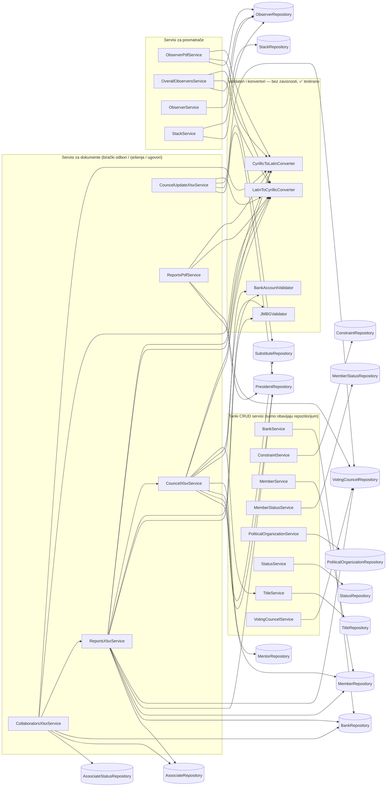
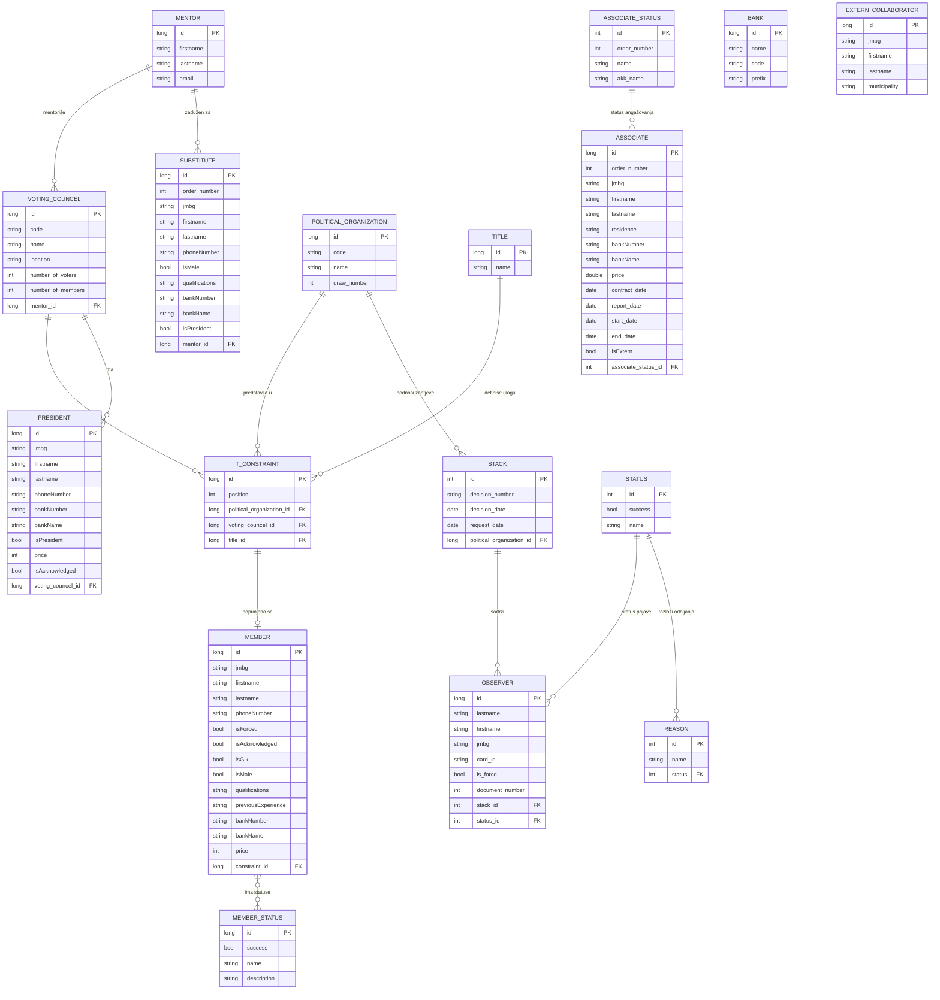

# 034B Banja Luka – aplikacija Gradske izborne komisije

Interna Vaadin/Spring Boot aplikacija za Gradsku izbornu komisiju (GIK) Banja Luka. Koristi se za pripremu i
provođenje izbora na području opštinske izborne jedinice 034B: akreditaciju posmatrača, sastav i ažuriranje
biračkih odbora, generisanje zvaničnih rješenja i izvještaja (PDF/DOCX/XLSX), kao i za ugovore sa
saradnicima angažovanim na izborima.

## Sadržaj

- [Tehnologije](#tehnologije)
- [Pokretanje aplikacije](#pokretanje-aplikacije)
- [Autentifikacija i pristup](#autentifikacija-i-pristup)
- [Funkcionalnosti](#funkcionalnosti)
  - [Posmatrači](#posmatrači)
  - [Birački odbori](#birački-odbori)
  - [Ugovori (samo administrator)](#ugovori-samo-administrator)
- [Prateći (cross-cutting) servisi](#prateći-cross-cutting-servisi)
- [Graf zavisnosti servisa](#graf-zavisnosti-servisa)
- [Model baze podataka](#model-baze-podataka)
- [Inicijalizatori podataka](#inicijalizatori-podataka)
- [Plan testiranja i refaktorisanja servisa](#plan-testiranja-i-refaktorisanja-servisa)

## Tehnologije

- **Vaadin Flow** – server-side UI framework (Java, bez pisanja JS/HTML za view-ove)
- **Spring Boot** – aplikativni okvir, dependency injection, Spring Security
- **Spring Data JPA / Hibernate** – pristup bazi podataka (šema `voting_system`)
- **Apache POI** – generisanje/čitanje `.xlsx` (Excel) i `.docx` (Word) fajlova
- **iText 7** – generisanje `.pdf` dokumenata (ugovori, rješenja, spiskovi)
- **Maven** – build alat (`./mvnw`)

## Pokretanje aplikacije

```
./mvnw
```

Aplikacija je dostupna na [http://localhost:8080](http://localhost:8080). Za produkcioni build:

```
./mvnw clean package -Pproduction
java -jar target/*.jar
```

## Autentifikacija i pristup

Prijava se vrši preko `LoginView` (Spring Security, `SecurityConfig`). Korisnici su definisani in-memory i imaju
role `USER` ili `USER + ADMIN`. Rute `/unutrasnji-saradnici` i `/spoljasnji-saradnici` (modul **Ugovori**) su
dostupne samo korisnicima sa rolom `ADMIN`; ostatak aplikacije je dostupan svakom prijavljenom korisniku
(`@PermitAll` na `MainLayout`). Meni "Ugovori" se u navigaciji uopšte ne prikazuje korisnicima bez odgovarajuće
role.

## Funkcionalnosti

Sve stranice (view-ovi) nalaze se u `com.example.application.views` i koriste servise iz
`com.example.application.services` za poslovnu logiku i generisanje dokumenata.

### Posmatrači

| Stranica (ruta) | Šta radi | Servisi koje koristi |
|---|---|---|
| `AddingObserversForm` (`/posmatraci/akredituj`) | Unos i akreditacija novih posmatrača za politički subjekt: validacija JMBG-a, dodjela statusa (prihvaćen/odbijen), vezivanje za "stack" zahtjeva. | `StackService`, `PoliticalOrganizationService`, `JMBGValidator`, `LatinToCyrillicConverter`, `MemberRepository`, `StatusRepository`, `ObserverRepository`, `PresidentRepository` |
| `ListView` (`/posmatraci/novi`) i `AddingStackForm` (`/posmatraci/stanje`) | Pregled političkih subjekata i kreiranje/uređivanje "stack-a" (zahtjeva/rješenja za određeni broj posmatrača po subjektu), uz mogućnost brisanja stacka i svih vezanih posmatrača. | `StackService`, `PoliticalOrganizationService` |
| `ObserverReportsView` (`/posmatraci/izvjestaji`) | Preuzimanje dokumenata za odabrani "stack": zbirni PDF/XLSX, akreditacije posmatrača, PDF/DOCX rješenja o prihvaćenim i odbijenim posmatračima. | `ObserverPdfService`, `PoliticalOrganizationService`, `StackService` |
| `OverallReportView` (`/zpirni-spisak-posmatraca`) | Generiše jedinstveni (zbirni) PDF spisak svih prihvaćenih posmatrača, sortiran ćirilično/latinično. | `OverallObserversService` |

### Birački odbori

| Stranica (ruta) | Šta radi | Servisi koje koristi |
|---|---|---|
| `DrawingView` (`/bo/zrijebanje`) | Žrijebanje – raspoređivanje predstavnika političkih subjekata (članova i zamjenika) na mjesta u biračkim odborima (`ConstraintEntity`). | `PoliticalOrganizationService`, repozitorijumi (`VotingCouncelRepository`, `TitleRepository`, `ConstraintRepository`), `LatinToCyrillicConverter` |
| `CouncelsByPoliticalOrganizationView` (`/bo/po/ps`) | Izvoz XLSX tabele sastava biračkih odbora, grupisano po političkom subjektu (uključujući mobilne timove). | `CouncelXlsxService`, `PoliticalOrganizationService` |
| `CouncelsByMentor` (`/bo/po/gik`) | Izvoz XLSX tabele biračkih odbora (sa ili bez predsjednika/zamjenika) grupisano po mentoru/članu GIK-a zaduženom za dio terena. | `CouncelXlsxService` |
| `DataUploadView` (`/bo/update`) | Uvoz/ažuriranje podataka o članovima BO i predsjednicima iz popunjenog XLSX fajla (potvrda angažovanja, cijena, ime, JMBG, telefon, tekući račun...). | `CouncelUpdateXlsxService`, `MemberRepository`, `ConstraintRepository`, `PresidentRepository` |
| `HealthCheckView` (`/health-check`) | Provjera grešaka u unesenim podacima (nevalidan JMBG, nepopunjeni podaci i sl.) po biračkim odborima. | `JMBGValidator`, `BankAccountValidator`, `CyrillicToLatinConverter`, repozitorijumi (`MemberRepository`, `ObserverRepository`, `PresidentRepository`, `VotingCouncelRepository`) |
| `BankAccountHealthCheckView` (`/health-check-by-bank-accounts`) | Fokusirana provjera ispravnosti brojeva tekućih računa članova BO i predsjednika. | `BankAccountValidator`, `JMBGValidator`, isti repozitorijumi kao gore |
| `ReportsView` (`/rjesenja`) | Generisanje zvaničnih PDF rješenja o imenovanju biračkih odbora – po biračkom mjestu ili po mentoru. | `ReportsPdfService` |
| `ShortReportsView` (`/skracena-rjesenja`) | Generisanje skraćene verzije PDF rješenja po biračkom mjestu. | `ReportsPdfService` |
| `MembersByBankReportView` (`/bo/po/bankama`) | Izvoz XLSX obračuna isplata (uz bruto/neto formule) članova BO i predsjednika, grupisano po banci; posebni listovi za "bez računa" i "pogrešan broj računa". | `ReportsXlsxService` |
| `SubstituteView` (`/rezervni-clanovi`) | Izvoz XLSX spiska rezervnih (zamjenskih) članova, sa bojenjem reda u zavisnosti da li je osoba već predsjednik/član. | `CouncelXlsxService` |

### Ugovori (samo administrator)

| Stranica (ruta) | Šta radi | Servisi koje koristi |
|---|---|---|
| `InternsView` (`/unutrasnji-saradnici`) | Uvoz unutrašnjih saradnika (zaposlenih Gradske uprave) iz XLSX, generisanje ugovora o djelu, izvještaja o obavljenom poslu i odluke o angažovanju (DOCX/PDF), na ćirilici ili latinici. | `CollaboratorsXlsxService` |
| `ExternsView` (`/spoljasnji-saradnici`) | Isto kao gore, ali za spoljašnje saradnike (uključuje i podatke o tekućem računu). | `CollaboratorsXlsxService` (interno koristi i `ReportsXlsxService` za izvještaj isplata po bankama) |

## Prateći (cross-cutting) servisi

Ovi servisi se ne vezuju za jednu stranicu, već ih koristi više view-ova/servisa:

- **`LatinToCyrillicConverter` / `CyrillicToLatinConverter`** – transliteracija teksta, jer se svi dokumenti mogu generisati i na ćirilici i na latinici (`ScriptEnum`).
- **`JMBGValidator`** – provjera ispravnosti JMBG-a (datum i kontrolna cifra).
- **`BankAccountValidator`** – provjera ispravnosti broja tekućeg računa (dužina + kontrolne cifre po modulu 97).
- **`TitleService`** – mapiranje titula člana/zamjenika člana BO (`TitleEnum`).
- **`PoliticalOrganizationService`, `StackService`, `BankService`, `MemberService`, `MemberStatusService`, `ObserverService`, `ConstraintService`, `VotingCouncelService`, `StatusService`** – tanki servisni slojevi iznad odgovarajućih repozitorijuma (CRUD/pomoćne metode za svoj entitet).

## Graf zavisnosti servisa

Dijagram prikazuje šta svaki servis iz `com.example.application.services` direktno koristi – druge servise,
repozitorijume (pravougaonici sa zaobljenim/cilindričnim oblikom) i validatore/konvertore. Servisi su grupisani
prema svojoj ulozi. Validatori i konvertori (`BankAccountValidator`, `JMBGValidator`, `CyrillicToLatinConverter`,
`LatinToCyrillicConverter`) nemaju nikakve zavisnosti – to su čisti "leaf" servisi, zbog čega su i bili prvi na
redu za unit testove (✅ već pokriveni testovima, vidi `src/test/java/.../services`).



Nekoliko stvari koje se vide iz grafa, a bitne su za plan testiranja/refaktorisanja:

- **`ReportsXlsxService` i `CollaboratorsXlsxService`** su najviše "umreženi" – pored repozitorijuma pozivaju i
  druge servise (`ReportsXlsxService` → `CouncelXlsxService`; `CollaboratorsXlsxService` → `ReportsXlsxService`),
  pa promjena u njima ima najveći domino-efekat.
- **Konvertori se koriste posvuda** (skoro svaki servis koji generiše dokument zavisi od oba), zato je bilo
  najvažnije da oni prvi budu tačni i pokriveni testovima.
- **Osam servisa u grupi "Crud"** (`BankService`, `ConstraintService`, `MemberService`, `MemberStatusService`,
  `PoliticalOrganizationService`, `StatusService`, `TitleService`, `VotingCouncelService`) su tanki omotači oko
  jednog repozitorijuma – neki od njih (`TitleService`, `PoliticalOrganizationService`) imaju i stvarnu logiku
  vrijednu testiranja, dok su ostali samo Lombok-generisani getteri bez logike.

## Model baze podataka

Sve tabele su u šemi `voting_system`. Dijagram prikazuje entitete iz `com.example.application.entities` i njihove veze:



Napomene uz model:

- `T_CONSTRAINT` (tabela `t_constraint`) predstavlja "mjesto" u biračkom odboru dodijeljeno jednom političkom subjektu (kroz žrijebanje) – kombinaciju biračkog mjesta, subjekta i titule (član/zamjenik). Kada je to mjesto popunjeno osobom, dobija povezani `MEMBER` (1:1).
- `ExternCollaboratorEntity` (`extern_collaborator`) trenutno nema definisane JPA relacije prema ostatku modela – koristi se kao samostalna evidencija.
- `AssociateEntity`/`AssociateStatusEntity` prate saradnike (unutrašnje i spoljašnje) angažovane po ugovoru o djelu, odvojeno od modela biračkih odbora.

## Inicijalizatori podataka

U paketu `com.example.application.initializers` nalaze se jednokratne (isključene, jer implementiraju
`ApplicationRunner` sa zakomentarisanim `@Override`) klase koje pune bazu početnim podacima: mentori, biračka
mjesta po godinama (`VotingCouncelInitializer`, `VotingCouncelInitializer2026`), politički subjekti, banke,
statusi, titule i mobilni timovi. Da bi se neki od njih izvršio pri pokretanju aplikacije, potrebno je otkomentarisati `implements ApplicationRunner` i `@Override` u odgovarajućoj klasi.

## Plan testiranja i refaktorisanja servisa

Testovi se pišu postepeno, servis po servis, prateći redoslijed od najizolovanijih (bez zavisnosti) ka
najsloženijim (generisanje dokumenata). Vidi [Graf zavisnosti servisa](#graf-zavisnosti-servisa) za kontekst.

### Završeno

- **`BankAccountValidator`** – testirano; refaktorisan bug gdje su nenumerički unizi dužine 7-11 karaktera bili
  pogrešno prihvatani, i moguć `NumberFormatException` na nenumeričkoj kontrolnoj cifri (16-cifreni format).
- **`JMBGValidator`** – testirano; popravljen bug u mod-11 kontrolnoj cifri (ostatak `1` je pogrešno davao
  kontrolnu cifru `10` umjesto `0`), datumska validacija pojednostavljena preko `LocalDate.of(...)`.
- **`CyrillicToLatinConverter`** / **`LatinToCyrillicConverter`** – testirano; popravljen `NullPointerException`
  u `convertToUppercase(null)`, i `toUpperCase()` bez `Locale` (moguć pogrešan rezultat pod turskom lokalizacijom)
  zamijenjen sa `toUpperCase(Locale.ROOT)`.

### Faza 1 – servisi sa stvarnom logikom (mokovanje jednog repozitorijuma)

- **`TitleService.getTitles()`** – mapira listu iz repozitorijuma u `Map<TitleEnum, TitleEntity>` po ID-u
  (1→ЧЛАН, 2→ЗАМЈЕНИК); provjeriti ponašanje kada ID-jevi ne postoje (trenutno se tiho ignorišu).
- **`PoliticalOrganizationService.getAll()` / `getAllDrawed()`** – sortiranje i filtriranje
  (`drawNumber != null && drawNumber > 0`).
- **`StackService.deleteStack()`** – briše sve posmatrače pa zatim stack; provjeriti da li se `delete` zaista
  poziva za svakog posmatrača i za sam stack, i ponašanje za praznu listu posmatrača.

### Faza 2 – čiste "helper" funkcije zakopane u velikim XLSX/dokument servisima

Isti obrazac kao kod validatora – male čiste funkcije bez testova jer su trenutno `private` unutar ogromnih
servisa:

- **`CollaboratorsXlsxService`**: `readNameCell`, `parseDateCell`, `calculatePosition`, `readBankNumber` /
  `readBankName`, `assignStatus`.
- **`CouncelXlsxService`**: `formatPhoneNumber`, `formatBankNumber`, `generateNameForTable`,
  `generatePresidentNameForTable`.
- **`CouncelUpdateXlsxService`**: `readNameCell` (obje varijante), `readGenderCell`, `readJmbg`,
  `readPhoneNumber` – uz posebnu pažnju na `tryReadingConstraint` logiku za podrazumijevanu političku
  organizaciju, koja djeluje krhko.
- **`ReportsXlsxService`**: `isBankNumberEmpty`, `findBankByPrefix`.

Ove metode bi trebalo učiniti paket-privatnim/testabilnim, ili izdvojiti u samostalne klase (npr.
`PhoneNumberFormatter`, `BankNumberFormatter`) – što bi ujedno omogućilo ponovnu upotrebu (npr.
`formatPhoneNumber`/`formatBankNumber` trenutno postoje samo u `CouncelXlsxService`).

### Faza 3 – manji servisi sa kolekcijama/sortiranjem

- **`OverallObserversService`** – filtrira (`success == true || force == true`) i sortira preko `Collator`-a;
  testabilno uz mokovan repozitorijum i par `ObserverEntity` primjera.

### Faza 4 – teški PDF/DOCX generatori (nizak prioritet za unit testove)

`ObserverPdfService`, `ReportsPdfService`, i preostali dio `CollaboratorsXlsxService`/`CouncelXlsxService` koji
direktno sastavljaju iText/POI dokumente. Ovo je pretežno "sastavljanje dokumenta" – skupo i krhko za smisleno
unit-testiranje (zahtijevalo bi renderovanje i parsiranje PDF/DOCX fajla). Predlog: ne testirati direktno, samo
izdvojiti i testirati eventualnu čistu logiku (kao u Fazi 2) ako postoji.

### Preskočeno (nema logike za testiranje)

`BankService`, `MemberService`, `MemberStatusService`, `ObserverService`, `StatusService`,
`VotingCouncelService`, `ConstraintService` – svaki je samo `@Data @Service` omotač oko jednog repozitorijuma,
bez ijedne linije logike. Test bi provjeravao samo Lombok-generisan getter.

### Usput primijećen refaktor kandidat

Metoda `getCollatorForScript(...)` je identično duplirana u najmanje dva servisa (`CouncelXlsxService`,
`OverallObserversService`) – kandidat za izdvajanje u zajedničku klasu/komponentu.